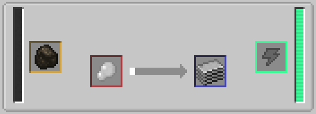
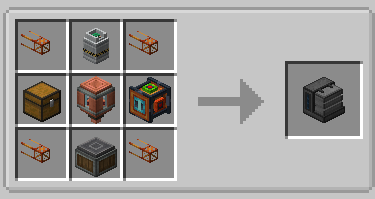
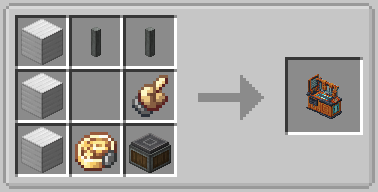
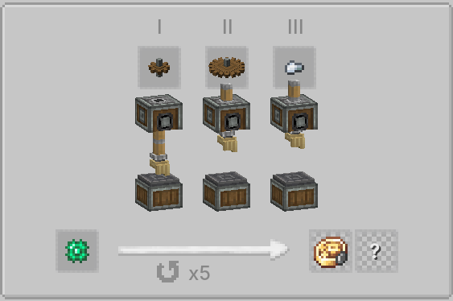
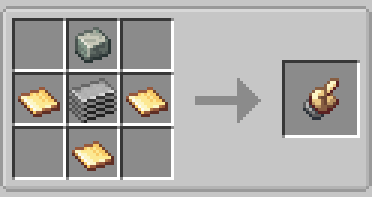
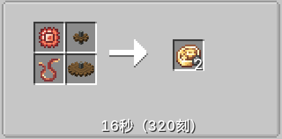

# 更新日志
> [!IMPORTANT]\
> 请注意分辨包里的文件夹名称，例如“mods”需要删除原游戏根目录的mods文件夹并替 换为新的，而“mods+”则是将其中的mod文件拖进现有的mods文件夹即可。  

[最新更新包](https://www.ilanzou.com/s/fcwxHaQk)

## 虚空行者 2026.6.29
- 艰苦卓绝首次在此仓库同步更新日志
- 开启死亡掉落
- **天境**加入世界刷新列表  
目前会被刷新的维度列表为`“主世界”` `天境`
### 添加模组
[天境](https://www.mcmod.cn/class/94.html)
[股市](https://www.mcmod.cn/class/27167.html)
[MEK发电机](https://www.mcmod.cn/class/1323.html)
[神化](https://www.mcmod.cn/class/1708.html)
[祸乱亡灵](https://www.mcmod.cn/class/5917.html)
[遗体](https://www.mcmod.cn/class/3007.html)
[沉浸式飞机](https://www.mcmod.cn/class/8527.html)
[沉浸画框](https://www.mcmod.cn/class/6947.html)
[吃不停](https://www.mcmod.cn/class/23341.html)
[工业先锋](https://www.mcmod.cn/class/979.html)
[奥日科技](https://www.mcmod.cn/class/15500.html)
[车万女仆](https://www.mcmod.cn/class/1796.html)
女仆摇曲柄
[寂静装备](https://www.mcmod.cn/class/2791.html)
遐想装备
[史诗战斗](https://www.mcmod.cn/class/3037.html)
### 特殊改动
在kubejs/asstes下添加了一份[股市](https://www.mcmod.cn/class/27167.html)的汉化文件，如果需要使用此模组功能，建议同步更新kubejs文件夹
### 替换配方

### 新增配方
